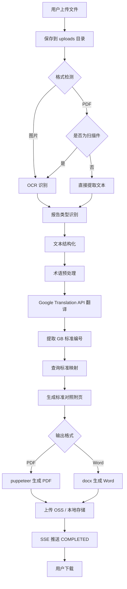

# SeaReport Translator - 产品需求文档（PRD）

## 1. 产品概述

SeaReport Translator 是面向国内跨境电商卖家与出口企业的东南亚质检报告在线翻译平台，通过 OCR + 多语种机器翻译 + 标准智能映射，将中文产品质检报告（PDF/图片）一键翻译为泰语、越南语、印尼语、马来语、柬埔寨语、缅甸语、老挝语，并自动生成中国 GB 标准与目标国对应标准的对照附页。

- **核心目标**：帮助跨境卖家在 5 分钟内完成原本需要 1-2 天的本地化报告交付，缩短出口东南亚的合规周期。
- **目标用户**：跨境电商运营、外贸业务员、出口企业品控人员。
- **市场价值**：东南亚是中国跨境电商出海的核心增量市场（GMV 增速 >25%），但各国质量标准语言门槛高，翻译服务严重依赖人工。

## 2. 核心功能

### 2.1 用户角色

| 角色 | 注册方式 | 核心权限 |
|------|----------|----------|
| 普通用户 (USER) | 手机号 + 验证码 | 上传/翻译报告、查询标准、查看订单 |
| 管理员 (ADMIN) | 内部创建 | 标准库/术语库 CRUD、用户与订单管理、系统设置 |

### 2.2 功能模块

1. **首页**：产品价值介绍、流程说明、定价卡片、SEO 落地
2. **翻译中心**：文件上传 → 语言选择 → 提交翻译 → 实时进度 → 结果下载
3. **标准查询**：按品类和国家查询 GB ↔ 目标国标准对应关系
4. **定价页**：FREE / BASIC / PRO 三档套餐对比
5. **登录页**：手机号 + 验证码登录（开发期先做密码登录）
6. **用户中心（/dashboard）**：工作台、订单历史、订单详情、账户设置
7. **管理后台（/admin）**：数据看板、用户管理、订单管理、标准库管理、术语库管理

### 2.3 页面详情

| 页面 | 模块 | 功能说明 |
|------|------|----------|
| / | Hero 区 | 主标题"一键翻译质检报告，轻松出海东南亚" + 副标题 + CTA |
| / | 语言展示 | 7 个东南亚国家国旗 + 语言名称 |
| / | 流程说明 | 上传 → 翻译 → 下载 三步骤图文 |
| / | 定价卡片 | FREE / BASIC / PRO 三档对比 |
| /translate | 文件上传区 | react-dropzone 拖拽，PDF/JPG/PNG，50MB 限制 |
| /translate | 翻译设置 | 目标语言下拉（带国旗）+ 输出格式（PDF/Word/对照版） |
| /translate/progress/[id] | 实时进度 | 大进度条 + 当前步骤 + 预计完成时间 + 取消按钮 |
| /translate/result/[id] | 结果下载 | 文件信息卡片 + 下载按钮 + 标准对照表 + 重新翻译 |
| /standards | 搜索筛选 | 输入 GB 标准 + 国家/品类筛选 |
| /standards | 结果表格 | GB 标准 \| 目标国标准 \| 标准名称 \| 差异说明 |
| /dashboard | 工作台 | 统计概览 + 最近任务 + 快捷操作 |
| /dashboard/orders | 订单列表 | 状态筛选 + 重新下载 + 删除 |
| /dashboard/orders/[id] | 订单详情 | 任务详情、文件预览、下载 |
| /dashboard/settings | 账户设置 | 个人信息、企业信息、修改密码 |
| /admin | 数据看板 | 今日订单、用户数、收入统计 |
| /admin/users | 用户管理 | 用户列表、搜索、详情 |
| /admin/orders | 订单管理 | 全部订单、状态管理、失败重试 |
| /admin/standards | 标准库 | 标准映射的增删改查 |
| /admin/terms | 术语库 | 术语的增删改查 |

## 3. 核心流程

### 3.1 翻译流程

用户上传文件 → 后端保存到 uploads 目录 → 格式检测（PDF/图片）→ OCR 识别文本（Google Cloud Vision）→ 报告类型识别（电子电器/纺织/玩具等）→ 文本结构化（标题/表格/段落/结论）→ 术语库预处理 → Google Cloud Translation API 分段翻译 → 提取 GB 标准编号 → 查询 StandardMapping 表生成对照附页 → puppeteer 生成 PDF / docx 生成 Word → 上传 OSS → 通知用户。

### 3.2 状态机

```
PENDING → OCR_PROCESSING → TRANSLATING → GENERATING → COMPLETED
   ↓          ↓                ↓             ↓
   └──────────┴────────────────┴─────────────→ FAILED
```

### 3.3 SSE 进度推送

订单创建后，前端通过 `EventSource` 连接到 `/api/orders/[id]/progress`，后端实时推送：

```json
{ "status": "OCR_PROCESSING", "progress": 15, "message": "正在识别文档内容..." }
{ "status": "TRANSLATING", "progress": 50, "message": "正在翻译第 3 页/共 6 页..." }
{ "status": "GENERATING", "progress": 85, "message": "正在生成翻译文档..." }
{ "status": "COMPLETED", "progress": 100, "message": "翻译完成！", "downloadUrl": "/api/download/xxx" }
```

### 3.4 流程图



## 4. 用户界面设计

### 4.1 设计风格

- **主色调**：蓝色 `#2563EB`（专业、可信）
- **辅助色**：绿色 `#10B981`（成功）、橙色 `#F59E0B`（处理中）
- **背景色**：`#F8FAFC` 浅灰主背景，白色卡片
- **字体**：Noto Sans（拉丁/中文） + Noto Sans Thai / Khmer / Myanmar（东南亚文字）
- **设计语言**：现代简约、专业可信、卡片化布局、克制的阴影与留白
- **按钮**：圆角 8px，主按钮填充蓝色，hover 加深；次按钮描边样式
- **图标风格**：使用 lucide-react，统一线性图标，圆角 2px

### 4.2 关键页面设计要点

| 页面 | 模块 | UI 元素 |
|------|------|----------|
| 首页 | Hero | 大字号蓝色主标题 + 渐变背景 + 国旗横排 |
| 翻译中心 | 上传区 | 虚线边框拖拽区，hover 蓝色高亮，已上传显示文件名+大小+页数 |
| 翻译中心 | 设置区 | 卡片右栏，下拉选择带国旗 emoji 前缀 |
| 进度页 | 进度条 | 蓝色填充，shimmer 动画，百分比 + 步骤名 + 预计时间 |
| 结果页 | 下载区 | 三个并列下载卡（PDF / Word / 对照版），成功状态绿勾 |
| 标准查询 | 表格 | 斑马纹，hover 高亮，差异说明可展开 |
| 用户中心 | 侧边栏 | 左侧 240px 固定宽度，主色图标 + 文字 |

### 4.3 响应式

- **桌面端**（≥1024px）：左右分栏，最大宽度 1280px 居中
- **平板端**（768-1023px）：上下堆叠，侧边栏折叠为顶部 Drawer
- **手机端**（<768px）：单列布局，底部固定操作栏，关键按钮 sticky

### 4.4 设计差异化亮点

- **国旗驱动**：所有语言选择与展示均带国家旗帜 emoji 增强识别度
- **进度可视**：翻译过程不仅是进度条，还显示"正在翻译第 X 页/共 Y 页"
- **标准对照**：翻译报告末尾自动追加中-外标准对照表（核心差异化）
- **术语一致**：所有专业词汇（甲醛含量、电气强度等）使用预设翻译，保证行业一致性
